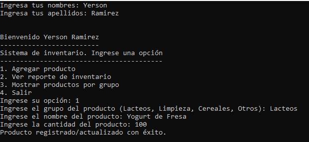
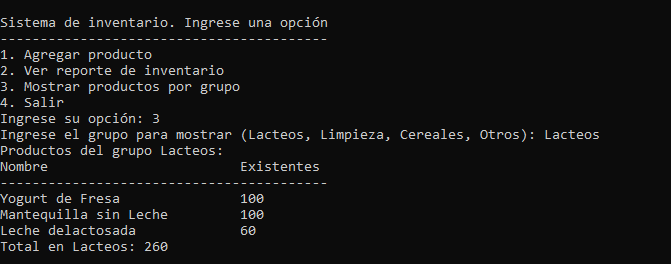
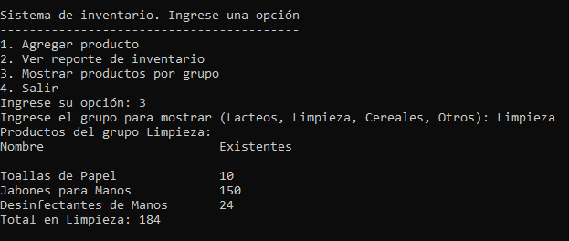
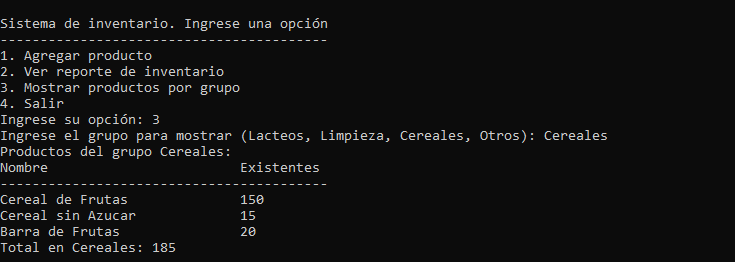
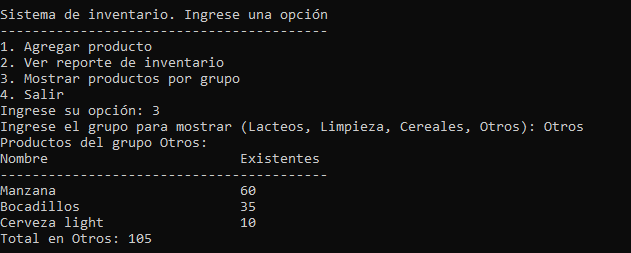
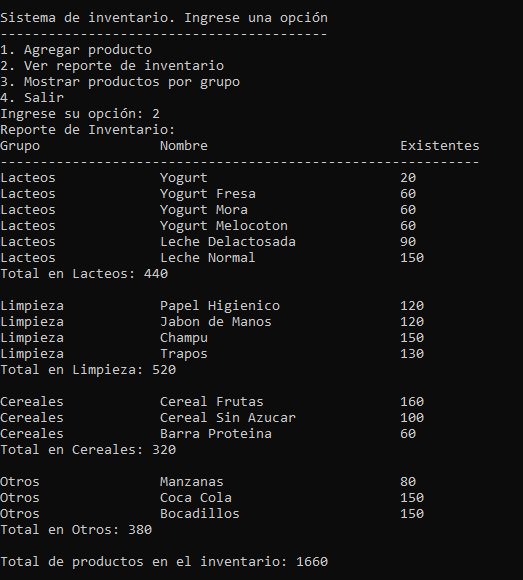
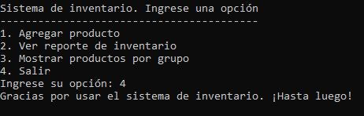

# Prueba tecnica
- En este repositorio se presentan cuatro ejercicios resueltos mediante funciones en Python. A continuación, se describen ambos ejercicios y sus soluciones:
##Ejercicio 1: Función para calcular una serie repetida
### Ejercicio 1:  Función para calcular una serie repetida a partir de un número dado y una cantidad de términos
- En este ejercicio, se proporciona una función llamada serie_repetida(numero, terminos) que calcula una serie repetida a partir de un número dado y una cantidad de términos especificada. La función toma dos argumentos: numero, que es el número inicial de la serie, y terminos, que es la cantidad de términos en la serie. La función devuelve la suma total de los términos de la serie.

        def serie_repetida(numero, terminos):
    
    	suma_total = 0  # Variable para almacenar la suma total de los términos 		de la serie
        termino_actual = 0  # Variable para mantener el término actual de la serie

         for i in range(terminos):
            termino_actual = termino_actual * 10 + numero  # Cálculo del término actual de la serie
            suma_total += termino_actual  # Agregar el término actual a la suma total

        return suma_total  # Devolver la suma total de los términos de la serie
## Ejercicio 2: Función para filtrar números en una lista
- En este ejercicio, se proporciona una función llamada filtrar_numeros(lista_entrada) que filtra una lista de entrada y devuelve una lista con números específicos que cumplen ciertas condiciones. La función toma una lista llamada lista_entrada como argumento y devuelve una lista llamada lista_salida que contiene los números filtrados.
### Función para filtrar números en una lista de entrada
	def filtrar_numeros(lista_entrada):
	lista_salida = []  # Se crea una lista vacía para almacenar los números 	 filtrados.

    for num in lista_entrada:
        # Si el número es mayor que 1000, se devuelve la lista actual sin procesar más elementos.
        if num > 1000:
            return lista_salida

        # Si el número es mayor que 600, se ignora y se pasa al siguiente elemento.
        if num > 600:
            continue

        # Si el número es divisible por 5, se agrega a la lista de salida.
        if num % 5 == 0:
            lista_salida.append(num)

    return lista_salida  # Se devuelve la lista filtrada.
## Ejercicio 3:  Agrupar Elementos Similares en una Lista
- En este repositorio se presenta una función en Python llamada agrupar_elementos_similares(lista) que tiene como objetivo agrupar elementos similares en una lista y devolver una lista de sublistas con los elementos agrupados. A continuación, se describe la función y se presentan ejemplos de uso:
### Función para agrupar elementos similares en una lista
	def agrupar_elementos_similares(lista):
    diccionario = {}  # Se crea un diccionario vacío para almacenar los elementos similares.

    for elemento in lista:
        if elemento in diccionario:
            # Si el elemento ya está en el diccionario, se agrega a su lista correspondiente.
            diccionario[elemento].append(elemento)
        else:
            # Si el elemento no está en el diccionario, se crea una nueva lista con el elemento.
            diccionario[elemento] = [elemento]

    lista_salida = list(diccionario.values())  # Se obtiene una lista con los valores del diccionario.

    return lista_salida  # Se devuelve la lista con los elementos similares agrupados.
## Ejercicio 4: Inventario 
###El código proporcionado es una implementación básica de un sistema de inventario con diversas funciones para realizar diferentes acciones. A continuación, se comentará cada función y su propósito dentro del sistema
### Función para mostrar un reporte completo del inventario
	def mostrar_reporte_inventario(inventario):
    # Encabezado del reporte
    print("Reporte de Inventario:")
    print("Grupo".ljust(20) + "Nombre".ljust(30) + "Existentes")
    print("-" * 60)

    # Variable para llevar el total de productos en todo el inventario
    total_productos = 0

    # Iterar sobre cada grupo en el inventario
    for grupo, (productos, existencias) in inventario.items():
        # Calcular el total de productos en el grupo
        total_grupo = sum(existencias)
        total_productos += total_grupo

        # Mostrar los productos y existencias del grupo
        for producto, cantidad in zip(productos, existencias):
            print(f"{grupo.ljust(20)}{producto.ljust(30)}{cantidad}")

        # Mostrar el total de productos en el grupo
        print(f"Total en {grupo}: {total_grupo}\n")

    # Mostrar el total de productos en el inventario completo
    print(f"Total de productos en el inventario: {total_productos}\n")
### Función para mostrar los productos y existencias de un grupo específico
	def mostrar_grupo(inventario, grupo):
    # Verificar si el grupo existe en el inventario
    if grupo in inventario:
        # Encabezado del reporte para el grupo específico
        print(f"Productos del grupo {grupo}:")
        print("Nombre".ljust(30) + "Existentes")
        print("-----------------------------------------")

        # Obtener los productos y existencias del grupo
        productos, existencias = inventario[grupo]

        # Mostrar los productos y sus existencias
        for producto, cantidad in zip(productos, existencias):
            print(f"{producto.ljust(30)}{cantidad}")

        # Calcular y mostrar el total de productos en el grupo
        total_grupo = sum(existencias)
        print(f"Total en {grupo}: {total_grupo}\n")

    else:
        # Mostrar un mensaje si el grupo no tiene productos registrados
        print("\n")
        print(f"No hay productos registrados en el grupo {grupo}.\n")
### Función para verificar si una cadena no está vacía
	def es_str_no_vacio(cadena):
    return isinstance(cadena, str) and len(cadena.strip()) > 0
### Función para verificar si una cadena contiene solo letras (sin espacios)
	def contiene_solo_letras(cadena):
    return all(caracter.isalpha() for caracter in cadena)
### Función para solicitar al usuario una cadena sin números y no vacía
	def solicitar_cadena_sin_numeros(mensaje):
    while True:
        entrada = input(mensaje)
        if es_str_no_vacio(entrada) and contiene_solo_letras(entrada):
            return entrada
        elif not es_str_no_vacio(entrada):
            print(
                "Error: No has ingresado un valor. Por favor, ingresa un valor no vacío."
            )
        else:
            print(
                "Error: No se aceptan valores numéricos ni caracteres especiales en este campo."
            )
### Función para solicitar y registrar los nombres y apellidos del usuario
	def registrar_persona():
    nombres = solicitar_cadena_sin_numeros("Ingresa tus nombres: ")
    apellidos = solicitar_cadena_sin_numeros("Ingresa tus apellidos: ")
    print("\n")
    tituloRegistrarPersona = f"Bienvenido {nombres} {apellidos}"
    print(tituloRegistrarPersona)
    print("-" * len(tituloRegistrarPersona))
### Función para mostrar el menú de opciones
	def mostrar_menu():
    tituloMostrarMenu = "Sistema de inventario. Ingrese una opción"
    print(tituloMostrarMenu)
    print("-" * len(tituloMostrarMenu))
    print("1. Agregar producto")
    print("2. Ver reporte de inventario")
    print("3. Mostrar productos por grupo")
    print("4. Salir")
### Función para registrar un producto en el inventario
	def registrar_producto(inventario, grupo, producto, cantidad):
    if grupo in inventario:
        productos, existencias = inventario[grupo]
        if producto in productos:
            # Actualizar la cantidad del producto si ya existe en el grupo
            index = productos.index(producto)
            existencias[index] += cantidad
        else:
            # Agregar el producto al grupo con su cantidad
            productos.append(producto)
            existencias.append(cantidad)
    else:
        # Crear un nuevo grupo y agregar el producto con su cantidad
        inventario[grupo] = ([producto], [cantidad])
#### Función para mostrar el inventario completo
	def mostrar_inventario(inventario):
    print("Nombre".ljust(30) + "Existentes")
    print("-----------------------------------------")

    # Iterar sobre cada grupo en el inventario
    for grupo, (productos, existencias) in inventario.items():
        # Mostrar los productos y existencias de cada grupo
        for producto, cantidad in zip(productos, existencias):
            print(f"{producto.ljust(30)}{cantidad}")

    print()  # Salto de línea al final del inventario
### Resultado del Ejercicio 4:

# Como se debe compilar

- Se manipula desde la consola y se realizo en el leguaje de programación de python.